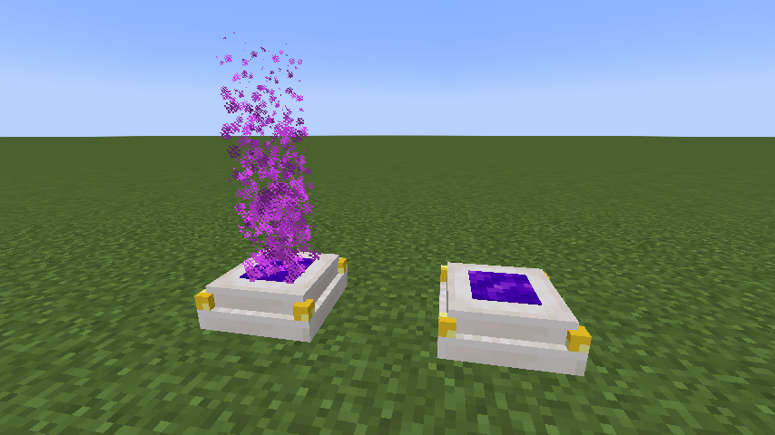

# Simple Teleporters

**SimpleTeleportersReloaded** is a mod to salvage Simple Teleporters to 1.18.2 since development stopped at 1.14.1.
There is only one change from the original mod.
It only does not support the ability to change the difficulty of a recipe using configs. All other features are supported.

## Original mod description

Simple Teleporters adds a craftable teleporter block to quickly travel your world!

### How to use this mod

To begin, you will need to craft an "Ender Shard" by heating up an Ender eye in a furnace

With this crystal you can sneak right click a block to create a link at a position you would like to teleport to.

You will now need to craft a "Teleporter" in a crafting table

Place this Teleporter on the ground and use the Ender Crystal you made earlier in it by right clicking with it in your hand. You can freely take the crystal out and put it back in.

Now you have a working teleporter! You can now step on it and sneak to be teleported to the position you linked the crystal to.

### Media

### FAQ

Q) What is this black smoke?

A) When holding a linked Ender Crystal, smoke will appear on the block that it is linked to, simple switch to another item to stop the smoke.

Q) Can I use this mod in my modpack?

A) Yes, as long as you provide a link back to either this page or the Minecraft Forums page and appropriate credit is given.

Q) Can I reupload this mod on my website? 

A) No, the only place to download this mod is this Curse page

Q) Can I make a video about this mod or with this mod in it?

A) Yes, you don't need to ask.

## Reference Mods

- [Simple Teleporters](https://www.curseforge.com/minecraft/mc-mods/simple-teleporters), by [Lemonszz](https://legacy.curseforge.com/members/Lemonszz/projects)

## License

This Mod is subject to the MIT License. See LICENSE.md for details.

